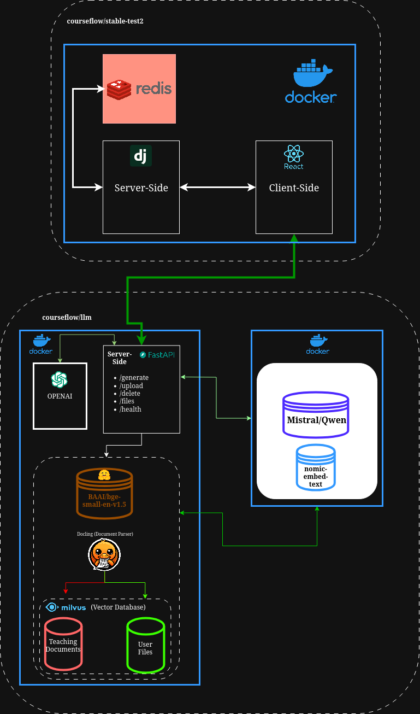
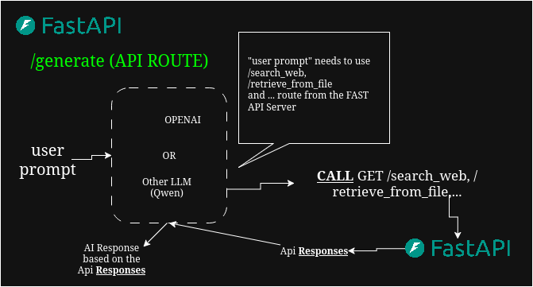
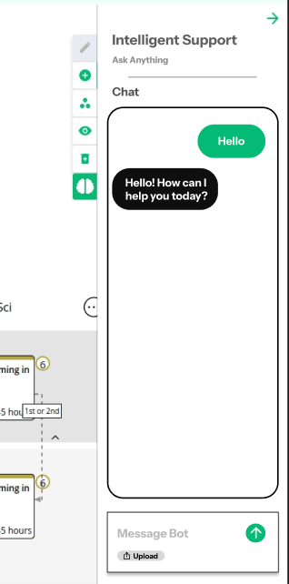
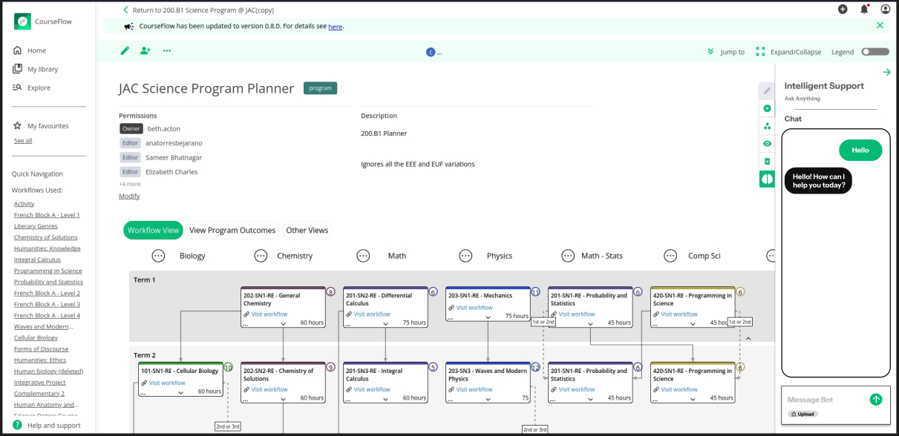

# Planning and Documentation

Go to Plan > Issue boards

## Architecture Chart

The following diagram shows how the llm project is connected to the original courseflow. Libraries, tools and relationships are also represented visually below.



## APIs

1. `GET /health` – Check server status (Monitoring)

2. `POST /generate` - Generates a response by searching the RAG first from the user's database and then the teachings database.

3. `POST /upload` - Uploads a file (HTML/DOCX/PDF) in the RAG Database.

4. `GET /files` - Gets all the files that has been posted in the RAG by a specific user.

5. `DELETE /delete` - Deletes a specific files inside the RAG Database.

6. `GET /docs` - SWAGGER (Documenting and Testing APIs)

## What Would Agent Integration Look Like?

The idea behind an agent feature is that an Artificial Intelligence will choose which tool to use to have a more efficient response towards a user. For instance, if someone prompts "What is a teacher?", the AI will first analyze the response and juge which available tools to use (e.g: search web, search uploaded documents, think more, etc...). At the end, the AI will generate a custom response based on the tool's answer.



## How does the RAG Work?

To perform RAG we need:
- A library that parses documents. **(Docling)**
	- *Docling is a special library that retrieves useful information from PDF, DOCX, XLSX, HTML, images, and more. This information represents all the contents of the files in text format. **FYI: Images are parsed differently with a separate model (vision).***
- A model to breakdown text into tokens/chunks. **(BAAI/bge-small-en-v1.5)**
	- *After the text is extracted, the AI won't understand the content and the meaning of the document. Tokens/chunks exist for a reason to split a huge text into smaller pieces so that it is easier to feed the embedding model.*
- A model to translate tokens/chunks into vectors. **(nomic-embed-text)**
	- *Now that the document is split into smaller units, a model is used to translate words for their appropriate mathematical meaning which are vectors (aka embeddings).*
- A database to store/retrieve the information. **(MilvusDB)**
	- *Milvus is a free vector database that is used to store all embeddings and retrieve them.*

How it works:

**Querying**:
```
[User Question] -> Embedding Model (nomic-embed-text) 
-> MilvusDB -> [Similar Chunks](Put as Context) -> LLM -> [Answer]
```

**Storing**:
```
[Documents] -> Docling -> Tokenize (BAAI/bge-small-en-v1.5) -> [Clean Chunks]
-> Embed (nomic-embed-text)-> MilvusDB
```

## Front-End Design (Draft)

**Detailed View**



**Full View**

